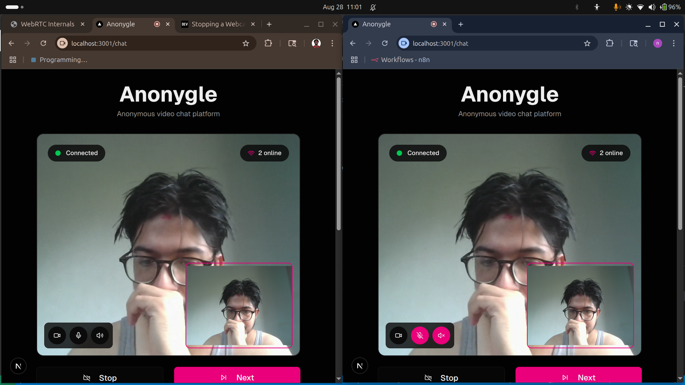
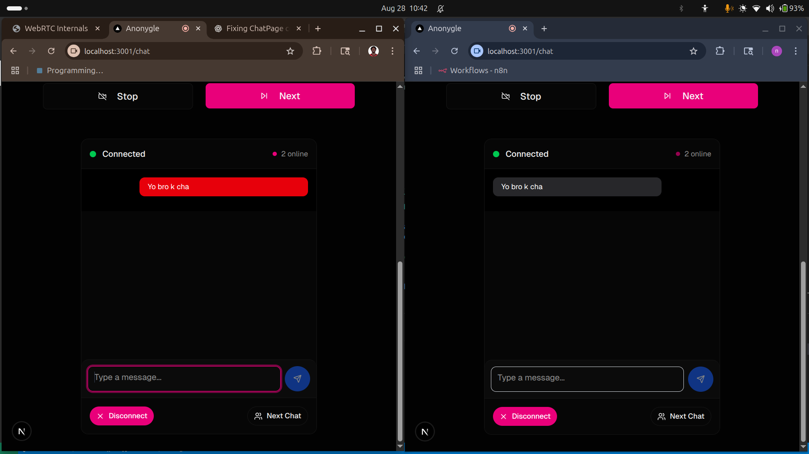

# Anonygle

Anonygle is a simple anonymous video chat app that connects you with strangers instantly—think of it as a more anonymous Omegle.  
Built with Socket.io, WebRTC, Next.js, and NestJS for seamless real-time video conversations.

## Getting Started
1. Clone the repo  
2. Install dependencies  
3. Run the app and start chatting anonymously!

## Features to Add
- Interest-based matchups 
- Peer-to-peer screen sharing
- Automatic bans for inappropriate behavior

